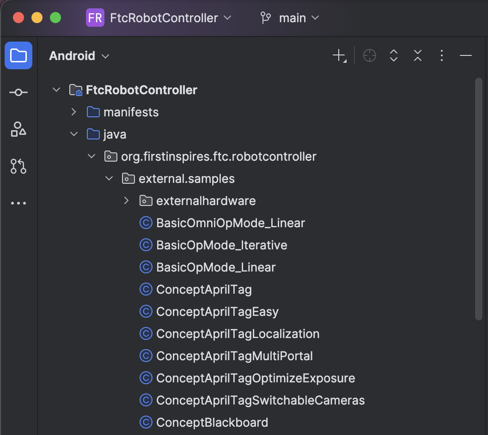

So you wanna learn how to program?
Heh good luck

Hi! I'm Caleb, and I stumbled through a season of FTC so you don't have to.
We've put together this learning plan to help you get up to speed.

## Starting Out

### Goals
- Learn the basics of Java.
- Understand how the robot works and how the driver station communicates with it.
- Play around in FTCSim.

### Resources

**CodeARobot**: https://www.codearobot.org

This is a cool site that walks you through learning Java for FTC. Go through this, and complete up until you get to Getting Ready for FTC.

**FTCSim**: https://ftcsim.org

This is a website that lets you use blocks to control a virtual robot to complete challenges. It's recommended to complete a few rounds of this.

- **FTC Docs – Programming Basics**: https://ftc-docs.firstinspires.org
- **REV Robotics Control System Guide**: https://docs.revrobotics.com/
- **Android Studio Setup for FTC**: https://ftc-docs.firstinspires.org/en/latest/programming_resources/android_studio_java/Android-Studio-Tutorial.html

## Coding the Robot

### Goals
- Build an Op Mode
- Use sensors and motor encoders for complex functions

### Plan

Use CodeARobot again, and complete up through Sensors and Feedback. Then, try to make an Op Mode or two!

If you need more examples, the FTC SDK provides you with some. Simply expand `FtcRobotController/java/org.firstinspires.ftc.robotcontroller/external.samples` in Android Studio, like so:

## Advanced Skills

### Goals
- Use odometry
- Build an autonomous op mode
- Make some good code

### Resources

Take what you know about comments, object orientation, etcetera, and go write some readable code! Code isn't just supposed to work; you (and others) need to read it.

Complete the rest of CodeARobot's course. However, CodeARobot uses Road Runner. I used PedroPathing. They're both different libraries for autonomous, but I like PedroPathing because we know how to use it. However, your team can decide which is better.

- PedroPathing: https://pedropathing.com

## Next Steps

### Kotlin

Kotlin is a more modern "version" of Java. Java and Kotlin are interchangeable in the same project, as they both compile for the JVM. I (Caleb) prefer Kotlin for several reasons:

- Null safety
- Modern, more language features
- Lots more

However, there are a couple cons:

- Not officially supported by FIRST (although, theoretically, it shouldn't cause problems, and it is competition legal)
- Almost all tutorials/documentation are made for Java

You should really only use Kotlin if you want Kotlin over Java, and know how they are interchangeable.

Learn more here: https://ftc-docs.firstinspires.org/programming_resources/shared/installing_kotlin/Installing-Kotlin.html

## Questions?

We know you have some. Talk to me, Caleb, and I'll try to search my brain for an answer. Good luck!